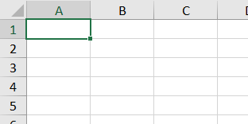

# Conceitos Básicos do Excel

> **Data:** 22 de julho de 2026

---

## Pasta de Trabalho

No Microsoft Excel, cada arquivo é chamado de **Pasta de Trabalho** (*Workbook*).

Uma pasta de trabalho pode conter uma ou mais planilhas, permitindo organizar diferentes informações em um único arquivo.

---

## Planilhas

As planilhas são identificadas por abas na parte inferior da janela.

Por meio delas é possível:

- Criar novas planilhas;
- Alternar entre planilhas;
- Renomear planilhas;
- Excluir planilhas.

A criação de uma nova planilha pode ser realizada através do botão **+**, localizado ao lado das abas existentes.

---

## Células

Cada retângulo presente na planilha é chamado de **célula**.

Uma célula é identificada pela combinação entre a coluna e a linha.

**Exemplo:**

- A1 → Coluna **A** + Linha **1**

- C5 → Coluna **C** + Linha **5**

É nas células que os dados são inseridos, como textos, números, fórmulas e funções.

---

## Tabelas

Um conjunto organizado de células preenchidas com informações forma uma **tabela**.

As tabelas são utilizadas para organizar e facilitar a análise dos dados.
