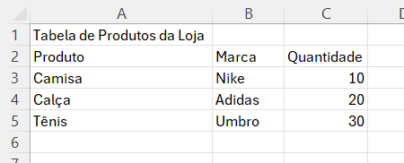
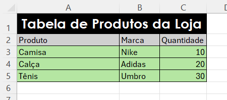
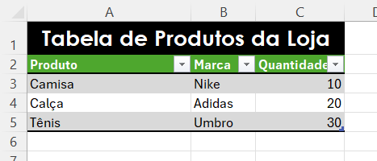

# Criação de Tabela

> **Data:** 03 de agosto de 2026

Criação de uma tabela simples no Excel

---

## Criando uma tabela

No Excel, é comum organizar informações utilizando tabelas para facilitar a visualização e análise dos dados.

Como prática de organização, muitas empresas costumam utilizar uma tabela principal para cada planilha. Por isso, é recomendado renomear a planilha de acordo com o objetivo da tabela.

Exemplo:  
```
Nome da planilha: Tabela de Produtos da Loja
```

---

## Estrutura da tabela

A tabela foi criada utilizando:

Linha 1: Título  
Linha 2: Cabeçalhos  
Linha abaixo do cabeçalho: células com os dados



---

## Personalizando a tabela

Para melhorar a visualização dos dados, é possível utilizar as ferramentas da guia **Página Inicial**.

Principais opções:

- Cor de preenchimento das células;
- Cor e tamanho da fonte;
- Negrito, itálico e sublinhado;
- Bordas;
- Alinhamento.

Exemplo: `Bordas → Todas as Bordas`

### Mesclar e Centralizar

Para centralizar um título que ocupa várias células:

1. Selecionar as células utilizadas pelo título;
2. Utilizar a opção: `Mesclar e Centralizar`

Essa opção une as células selecionadas e posiciona o texto no centro.



### Limpar Formatação

Caso seja necessário remover apenas a aparência de uma célula:

`Selecione a(s) célula(s) desejada(s) → Limpar → Limpar Formatos`

Essa opção remove a formatação, mantendo os valores inseridos.

---

### Formatar como Tabela

Outra forma de criar uma tabela é utilizando o recurso: `Formatar como Tabela`

Após selecionar os dados:

- Escolha um estilo de tabela;
- Clique em OK.

O Excel aplica uma formatação automática e adiciona filtros aos cabeçalhos.



### Filtros

Os filtros permitem organizar e encontrar informações dentro da tabela.

Contidas nas **setas**, é possível:

- Ordenar dados em ordem alfabética;
- Organizar números;
- Pesquisar informações específicas.

Para remover um filtro: `Clique na seta do cabeçalho → Limpar Filtro`
