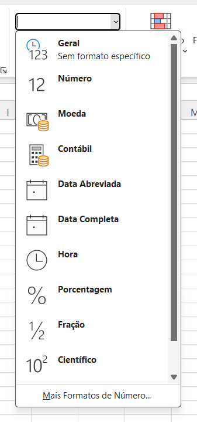
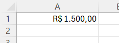

# Formatar Células

> **Data:** 26 de agosto de 2026

A formatação de células permite definir como os dados serão apresentados na planilha, como textos, números, valores monetários, datas e horários.

---

## Principais Formatações

### Geral

É o formato padrão do Excel.

Pode ser utilizado para textos, palavras e informações em geral.
Também pode ser utilizado para números quando nenhuma formatação específica foi definida.

###  Número

Utilizado para trabalhar com valores numéricos.

Permite representar números inteiros e decimais.
A vírgula é utilizada para indicar casas decimais no padrão brasileiro.
O ponto pode aparecer como separador de milhares, dependendo da configuração regional.

Exemplo: `1.500,50`

### Fração

Exibe números decimais na forma de frações.

Exemplo: `0,5 → 1/2`

### Porcentagem

Exibe o valor acompanhado do símbolo %.

Exemplo: `0,25 → 25%`

### Moeda

Utilizado para representar valores monetários.

No Brasil, o símbolo R$ é utilizado.

Exemplo:

### Contábil

Também é utilizado para valores monetários, porém possui uma apresentação diferente.

O símbolo da moeda fica alinhado à esquerda da célula, enquanto o valor fica alinhado separadamente.

Exemplo:

**OBS:** o formato Contábil é bastante utilizado para apresentar valores financeiros de maneira organizada.

### Data abreviada

Exibe a data de forma mais curta.

Exemplo: `26/08/2026`

Normalmente apresenta dia, mês e ano.

### Data completa

Exibe a data com mais informações, incluindo o dia da semana.

Exemplo: `quarta-feira, 26 de agosto de 2026`

Ao alterar uma data abreviada para o formato de Data completa, o Excel mantém a mesma data, apenas modifica a **forma como ela é apresentada**.

### Hora

Utilizado para representar horários.

Pode apresentar horas, minutos e segundos, dependendo da configuração escolhida.

Exemplo: `14:30:45`

---

## Uma coisa importante para guardar

Formatação não necessariamente altera o valor da célula; ela altera a maneira como o valor é exibido.

Por exemplo, uma célula pode conter `0,5` e ser exibida como `50%` quando você aplica o formato **Porcentagem**.
